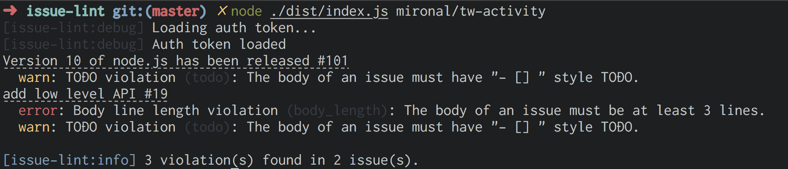

# issue lint

A linter for GitHub issue.

> This project is currently in the proof of concept.

## Usage

Sorry, currently npm install is not supported. (>︿<｡)

```sh
git clone git@github.com:mironal/issue-lint.git

cd issue-lint

npm run build

## Auth is executed only for the first time.
node dist/index.js

node dist/index.js -i # run interactive mode
node dist/index.js <owner/repo>
```

### Auth


### Lint



## TODO

- Support configuration file. Like .eslintrc
- Support pluggable feature.
